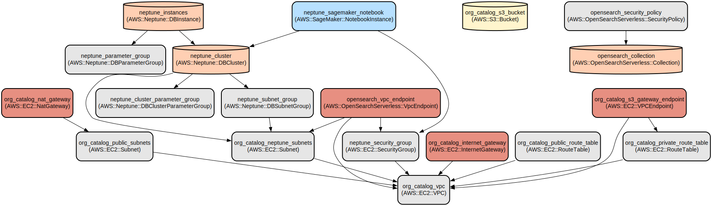

# AWS Infrastructure as Code for Data Domain Ingestion and Processing

A comprehensive Terraform-based infrastructure solution for managing data ingestion, processing, and storage across AWS services with secure enclave support. This project provides automated deployment of a scalable, serverless architecture for handling large-scale data operations.

The infrastructure includes automated data ingestion pipelines, secure data storage, processing capabilities, and graph database integration. It leverages AWS services like Lambda, Step Functions, S3, Neptune, and EventBridge to create a robust data processing platform with features including:

- Secure data ingestion with multi-stage processing
- Automated thumbnail generation for images
- Graph database integration with Neptune
- Serverless compute with AWS Lambda and Step Functions
- Event-driven architecture using EventBridge and SQS
- Fine-grained access control with IAM roles
- VPC networking with secure communication

## Repository Structure
```
.
├── modules/
│   ├── data-domain-ingestion/          # Core data ingestion infrastructure
│   │   ├── batch_job.tf               # AWS Batch job configurations
│   │   ├── lambda.tf                  # Lambda function definitions
│   │   ├── statemachine.tf           # Step Functions workflow
│   │   └── event_pipe.tf             # Event processing pipeline
│   ├── endor-infra/                   # Main infrastructure components
│   │   ├── api_gateway.tf            # API Gateway configuration
│   │   ├── neptune.tf                # Neptune database setup
│   │   ├── vpc.tf                    # VPC networking
│   │   └── waf.tf                    # Web Application Firewall rules
│   ├── image-viewer-infra/            # Image processing infrastructure
│   │   ├── lambda.tf                 # Image processing Lambda functions
│   │   └── glue.tf                   # Glue job configurations
│   └── terraform-modules/             # Reusable Terraform modules
        ├── common-modules/            # Shared infrastructure components
        ├── terraform-aws-vpc/         # VPC module
        ├── terraform-aws-s3/          # S3 bucket module
        └── terraform-aws-neptune/     # Neptune database module
```

## Prerequisites

### Required Versions
- Terraform >= 1.0, < 1.1
- Terragrunt >= 0.45.0
- AWS CLI >= 2.0
- Python >= 3.10

### Provider Versions
```hcl
provider "aws" {
  version = "5.51.0"
}

provider "template" {
  version = "~> 2.0"
}
```

### Required Tools
- AWS CLI configured with appropriate credentials
- Docker >= 20.10 (for container builds)
- jq >= 1.6
- git >= 2.0
- make >= 4.0

### AWS Account Requirements
- AWS account with permissions to create required resources
- IAM permissions for creating:
  - VPC and networking resources
  - Lambda functions
  - S3 buckets
  - Neptune clusters
  - EventBridge rules
  - IAM roles and policies

## Installation

1. Clone the repository:
```bash
git clone <repository-url>
cd <repository-name>
```

2. Install Terragrunt:
```bash
brew install terragrunt # MacOS
# or
curl -L https://github.com/gruntwork-io/terragrunt/releases/download/v0.45.0/terragrunt_linux_amd64 -o terragrunt # Linux
chmod +x terragrunt
sudo mv terragrunt /usr/local/bin
```

3. Configure AWS credentials:
```bash
aws configure
```

4. Initialize Terragrunt:
```bash
terragrunt init
```

## Quick Start

### Terragrunt Configuration

1. Create a root `terragrunt.hcl` file:
```hcl
remote_state {
  backend = "s3"
  config = {
    bucket         = "XXXXXXXXXXXXXXXXXX"
    key            = "${path_relative_to_include()}/terraform.tfstate"
    region         = "eu-central-1"
    encrypt        = true
    dynamodb_table = "my-lock-table"
  }
}

inputs = {
  environment = "dev"
  region      = "eu-central-1"
}
```

2. Create environment-specific configurations:
```hcl
# environments/dev/terragrunt.hcl
include {
  path = find_in_parent_folders()
}

terraform {
  source = "../../modules//endor-infra"
}

inputs = {
  environment = "dev"
  vpc_cidr    = "10.0.0.0/16"
}
```

3. Deploy the infrastructure:
```bash
# Initialize and plan all modules
terragrunt run-all plan

# Apply specific module
cd environments/dev/endor-infra
terragrunt apply

# Apply all modules
terragrunt run-all apply
```

### More Detailed Examples

1. Setting up an image processing pipeline:
```hcl
module "image-viewer-infra" {
  source = "./modules/image-viewer-infra"
  
  thumb_img_width = 200
  thumb_img_height = 200
  max_size_toinvoke_glue = 100
}
```

2. Configuring Neptune database:
```hcl
module "neptune" {
  source = "./modules/terraform-modules/terraform-aws-neptune"
  
  cluster_identifier = "my-neptune-cluster"
  instance_count = 2
  max_capacity = 8
  min_capacity = 1
}
```

### Troubleshooting

Common Issues:

1. VPC Endpoint Creation Failure
```bash
# Check VPC endpoint status
aws ec2 describe-vpc-endpoints --filters Name=vpc-id,Values=<vpc-id>

# Solution: Ensure proper subnet routing and security group rules
```

2. Neptune Connection Issues
```bash
# Verify security group rules
aws ec2 describe-security-groups --group-ids <security-group-id>

# Solution: Check VPC peering and routing tables
```

## Data Flow
The infrastructure processes data through multiple stages, from ingestion to storage and processing.

```ascii
[S3 Bucket] --> [EventBridge] --> [Lambda] --> [Step Functions]
     |              |               |               |
     v              v               v               v
[DynamoDB] <-- [SQS Queue] <-- [Glue Jobs] <-- [Neptune DB]
```

Key interactions:
- S3 events trigger Lambda functions for data processing
- Step Functions orchestrate complex workflows
- EventBridge routes events between components
- Neptune stores processed data in graph format
- DynamoDB maintains metadata and state
- SQS provides reliable message queuing

## Infrastructure



### Lambda Functions
- `endor_ingest_lambda`: Handles data ingestion (Python 3.10)
- `thumbnail_lambda`: Processes image thumbnails
- `auth_lambda`: Manages authentication

### Storage
- S3 Buckets:
  - Prestage bucket for initial data landing
  - Stage bucket for processed data
  - Ingest bucket for final storage

### Compute
- AWS Batch jobs for heavy processing
- Glue jobs for ETL operations
- Step Functions for workflow orchestration

### Networking
- VPC with public and private subnets
- VPC endpoints for AWS services
- Security groups for access control

### Databases
- Neptune cluster for graph data
- DynamoDB tables for metadata
- OpenSearch for full-text search